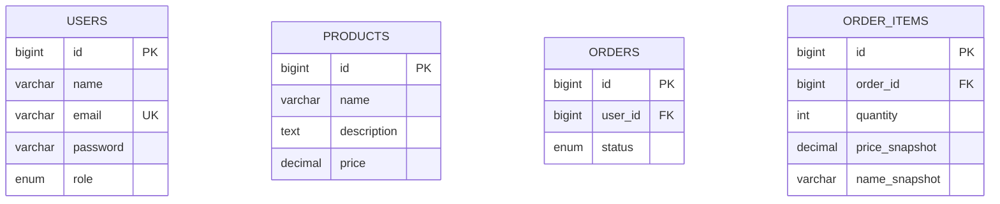

# ERD

## Relationships

- `users` 1 to many `orders`
- `orders` 1 to many `order_items`
- `order_items` stores a snapshot of product name and price at checkout time
- `products` is referenced during checkout but is not directly linked from `order_items`

## Notes

- Cart is a frontend-only local state and does not exist in the backend database.
- Order snapshots are persisted so historical orders remain unchanged if product data changes later.
